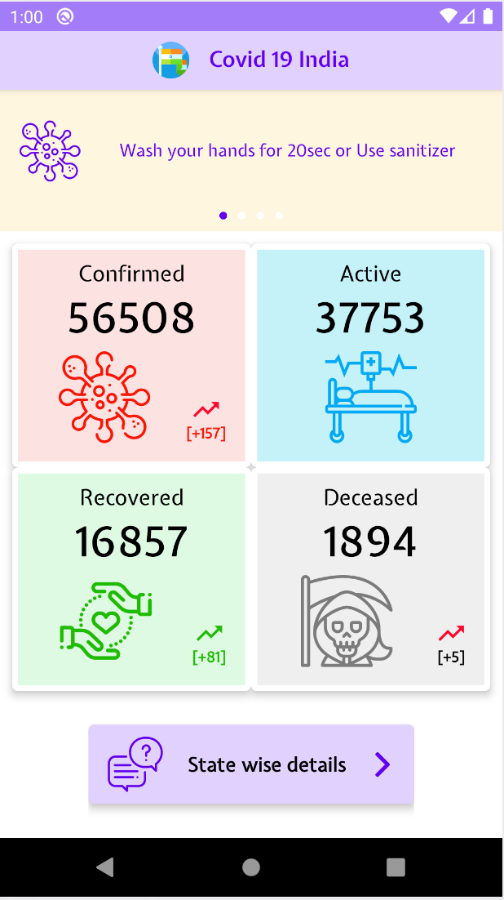
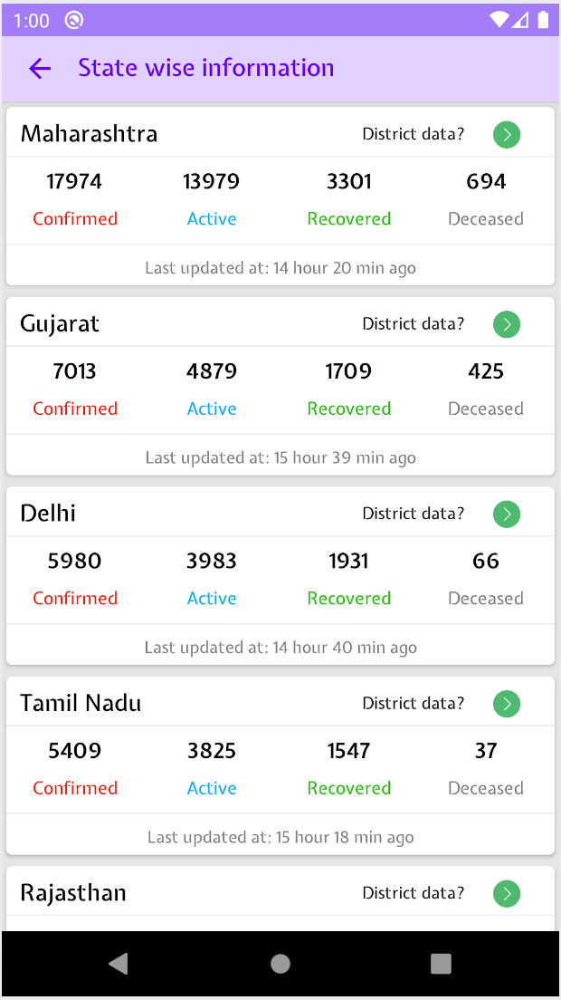
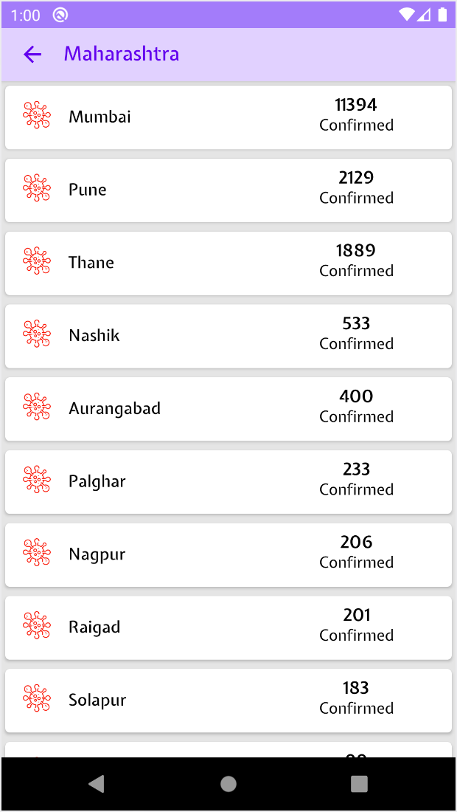

# covid19-tracker
We can track covid19 cases in india

Used the following concepts
1. MVVM architecture
1. Koin dependency injection
1. Koin Flow for asynchronious data operations
1. Coroutines for multiple threaded and different scope operations
1. View binding for xml file binding in UI components (Activity, Fragment)
1. Retrofit for rest API calls
1. Gson for JSON data conversion
1. Android architecture component
1. Kotlin extention components
1. Material libraries

**Note:Use the above code for architecturing your code. Don't copy it directly, As it won't improve your knowledge. 
If any improvements needed on the repo please commit.**

 

